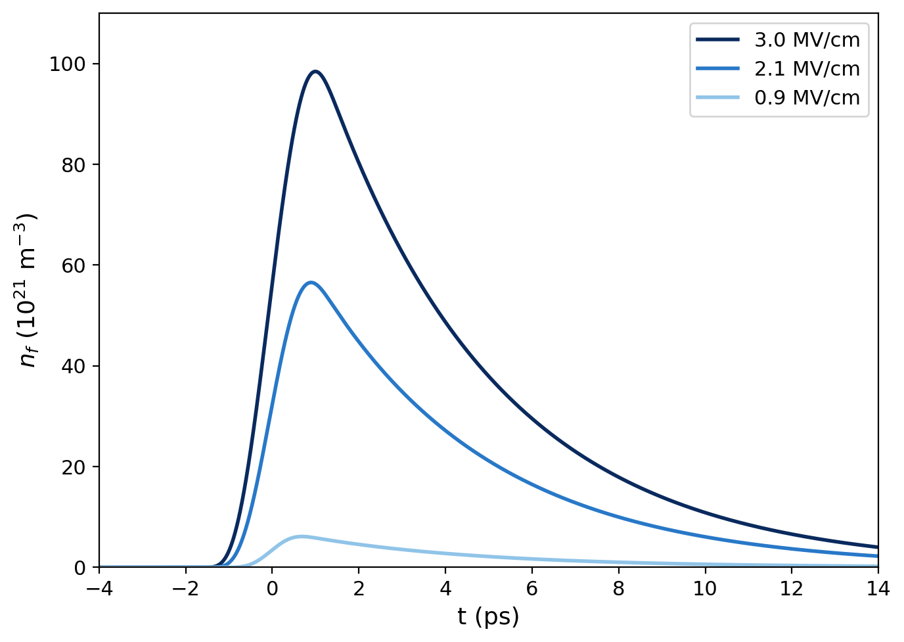

# H2O – THz Pulse & Water Interaction Simulation

Simulates the evolution of free-electron density in liquid water driven by an
intense terahertz (THz) pulse, including collisional ionisation and
energy-dependent collision frequency.

## Physics model

Two coupled ordinary differential equations are solved for each field strength:

| Variable | Equation | Description |
|----------|----------|-------------|
| `ε(t)` | `dε/dt = P_abs − ν_loss·ε − ν_i(ε)·ε_i` | Mean electron energy |
| `n(t)` | `dn/dt = [ν_i(ε) − ν_att]·n + W_tun(E)·n_mol` | Electron density |

- **Drude heating** (cycle-averaged): `P_abs = e²E_env²ν_c / [m_e(ω₀² + ν_c²)]`
- **Energy-dependent collision frequency**: `ν_c(ε) = ν_c0 · √(ε / ε_ref)`
- **Collisional ionisation** (Townsend): `ν_i(ε) = A_imp · exp(−ε_i / ε)`
- **Tunnel ionisation**: `W_tun(E) = A_tun · exp(−β / E)`
- **Electron attachment**: constant rate `ν_att = 1/τ_att`

## THz pulse

| Parameter | Value |
|-----------|-------|
| Centre frequency | 0.2 THz |
| Pulse width (FWHM) | 1.8 ps |
| Field strengths | 0.9 / 2.1 / 3.0 MV/cm |

## Usage

```bash
python thz_water_simulation.py
```

Produces `electron_density.png` – the electron density vs time for each field
strength, matching the expected behaviour from experiment.

## Output


